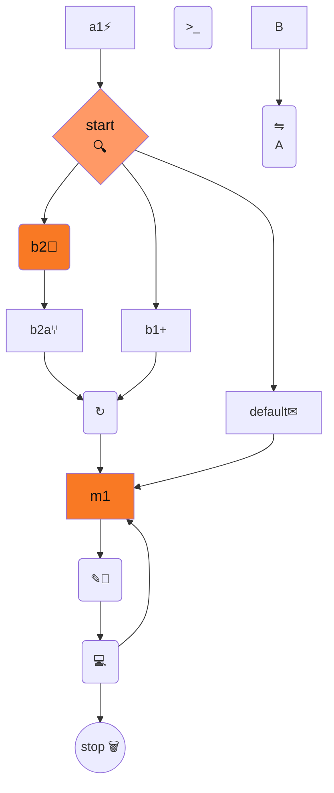

# Some title
| and a table| asd |
|---|---|
|more | asd |

```mermaid
flowchart TB
a1[a1⚡]
d1{start\n🔍}:::decision
b1[b1+]
b2(b2🚫):::assignment
b2a[b2a⑂]
b3[default✉]
m1:::assignment
m2(✎📝)
m3(💻)
m4(>_)
stop((stop 🗑))

a1 --> d1
d1 --> b1
b2 --> b2a
b2a --> b1a
d1 --> b2
d1 --> b3

b1a --> m1
b3 --> m1
m1 --> m2
m2 --> m3
m3 --> m1
m3 --> stop
b1 --> b1a(↻)

    B-->E(⇋\nA)


click m1 callback "Tooltip for a callback"

classDef decision fill:#f96,font-size:14pt,color:#111
classDef assignment fill:#F97924,font-size:14pt,color:#111
```
